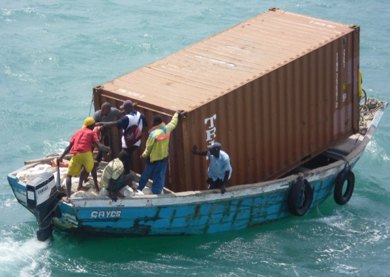

## Deploying Containers

#### What do you do now that you have an image?

<div>
<br/>
<small>Adam Burnett | <a href="https://twitter.com/BurDotNet">@BurDotNet</a> | GitHub: <a href="https://github.com/aburnett">aburnett</a> | Product Architect -- Cox Automotive</small>
</div>

---

## Quick recap

* Built an image
* Started a container locally
* Pushed to a Docker registry
* Maybe you have a docker-compose file defining your stack

---

## Ship It!
<div>

</div>
---

## Creating Hosts

<p>
<table>
<tr>
  <td style="vertical-align:middle">
  Enter __Docker Machine__

  <ul>
    <li>Creates VMs on various providers</li>
    <li>Configures daemon TLS certs</li>
    <li>Configures local client to point to a given host</li>
    <li>Supports: GCE, AWS, Digital Ocean, VitualBox, vSphere, [and more!](https://docs.docker.com/machine/drivers/)</li>
  </ul>

  <small> </small>

  </td>
  <td>
  
  </td>
</tr>
</table>
</p>

```
$ docker-machine create -d google --google-project projectX whale01
...
$ docker-machine ls
NAME      ACTIVE   DRIVER       STATE     URL                         SWARM
default   -        virtualbox   Running   tcp://192.168.99.100:2376
whale01   -        google       Running   tcp://172.xxx.xx.xxx:2376
```

---

## Controlling Machines

```
$ eval $(docker-machine env default)
[🐳 default: 192.168.99.100] $ eval $(docker-machine env whale01)
[🐳 whale01: 172.xxx.xx.xxx] $
```

`env` sets docker environment variables to point your client at a particular host.

_Now you can use `docker` to start containers anywhere!_

Note:
This is all well and good but is very manual. That's where an orchestration tool comes
into play

---

## Container Orchestration

<p>
`docker-machine` is great to get going quickly but generally doesn't do well
in more elastic architectures. Also doesn't leave room for extra provisioning you
may need to perform on your VMs or infrastructure.
</p>
<p>
Orchestration tools get your containers running across your infrastructure
and help manage scaling, upgrading and monitoring your application.
</p>
<p>
There are many options in this space! Everyone wants to help you run your
containers!
</p>

---

## To Name a Few

<div>
<span></span>
<span></span>
</div>
<div>
<span></span>
<span></span>
<span></span>
<span></span>
</div>
<div>
<span></span>
<span></span>
<span></span>
</div>

---

## Demo!

---

## Operations!

<p>
Once you go live you'll want monitoring and auditing of both the docker daemon as well as the running containers.
</p>
<p>
Many options here as well. Likely will vary related to your choice of orchestration
framework.
</p>

---

## Monitoring Daemon

`docker events` - Auditing of live event stream from daemon.

`docker inspect` - All information about a running container.

`docker info` - General system information

`docker.log` - Docker daemon log

Disk Space! - Watch your volume usage! `docker rm -v` FTW.

---

## Monitoring Containers

<small>Out of the box...</small>

`docker stats`
```
CONTAINER      CPU %   MEM USAGE / LIMIT    MEM %    NET I/O               BLOCK I/O
1dcc4f4844cf   0.00%   518.6 MB / 3.88 GB   13.37%   27.21 MB / 83.58 MB   2.142 MB / 42.49 MB
```

Many, many options here. Both hosted and do-it-yourself.

<small>cAdvisor, NewRelic, DataDog, Prometheus, heapster, sysdig, ...</small>

---

## Demo!

---

## Thoughts

Deploying your application with Docker requires many design considerations up front!

* Do not treat the containers as virtual machines
* Are you [12 Factor?](http://12factor.net/)
* Ship your logs somewhere (syslog, Sumo, Graylog, etc)
* Ship your metrics somewhere (graphite, NewRelic, etc)
* Avoid local state
* Design for failure
