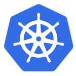

## Deploying Containers

#### What do you do now that you have an image?

<p>
<br/>
<small>Adam Burnett | <a href="https://twitter.com/BurDotNet">@BurDotNet</a> | GitHub: <a href="https://github.com/aburnett">aburnett</a></small>
<br/>
<small>Product Architect -- Cox Automotive</small>
</p>

---

## Quick recap

* Built an image
* Started a container locally
* Pushed to a Docker registry
* Maybe you have a docker-compose file defining your stack

_Do It Live!_

---

## Creating Hosts

<p>
<table>
<tr>
  <td style="vertical-align:middle">
  Enter __Docker Machine__

  <ul>
    <li>Creates VMs on various providers</li>
    <li>Configures daemon TLS certs</li>
    <li>Configures local client to point to a given host</li>
    <li>Supports: GCE, AWS, Digital Ocean, VitualBox, vSphere, [and more!](https://docs.docker.com/machine/drivers/)</li>
  </ul>

  <small> </small>

  </td>
  <td>
  
  </td>
</tr>
</table>
</p>

```
$ docker-machine create -d google --google-project projectX whale01
...
$ docker-machine ls
NAME      ACTIVE   DRIVER       STATE     URL                         SWARM
default   -        virtualbox   Running   tcp://192.168.99.100:2376
whale01   -        google       Running   tcp://172.xxx.xx.xxx:2376
```

---

## Controlling Machines

```
$ eval $(docker-machine env default)
[🐳 default: 192.168.99.100] $ eval $(docker-machine env whale01)
[🐳 whale01: 172.xxx.xx.xxx] $
```

`env` sets docker environment variables to point your client at a particular host.

_Now you can use docker the same way as you would locally to start containers anywhere_

Note:
This is all well and good but is very manual. That's where an orchestration tool comes
into play

---

## Container Orchestration

<p>
Orchestration tools get your containers running across your infrastructure
and help manage scaling, upgrading and monitoring your application.
</p>

<p>
There are many options in this space! Everyone wants to help you run your
containers!
</p>

---

## To Name a Few

<p>
<span></span>
<span></span>

</p>
<p>
<span></span>
<span></span>
<span></span>
<span></span>
</p>
<p>
<span></span>
<span></span>
<span></span>
</p>
